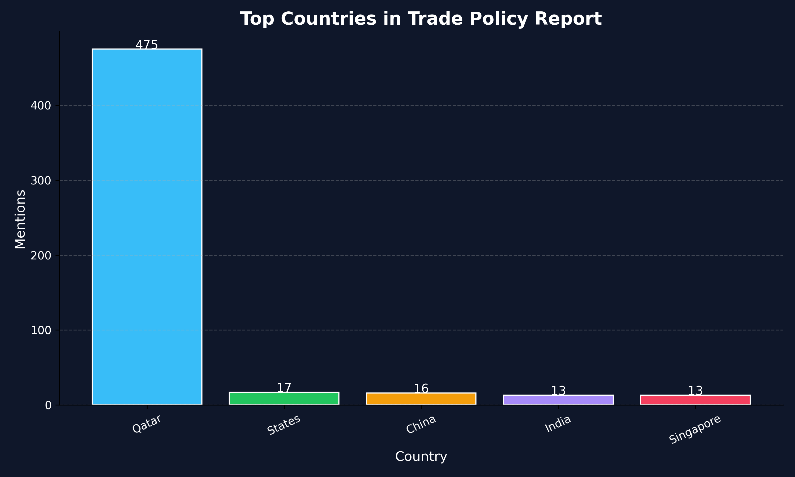

                                #🌍 WTO TRADE POLICY INTELLIGENCE SYSTEM 

##🧠 Overview
###This project analyzes WTO Trade Policy Reports using NLP and converts unstructured text into structured policy insights and visual summaries.

##⚙️ Pipeline
###PDF → Text Extraction → Cleaning → NLP → Insights → Visualization

##📊 Features
###Extracts countries and organizations
###Generates policy insights
###Visualizes key trade patterns
###Produces structured output

##📁 Project Structure
###main.py – main execution
###src/ – core modules
###requirements.txt – dependencies

##🚀 How to Run
###python main.py

##📈 Visualization

